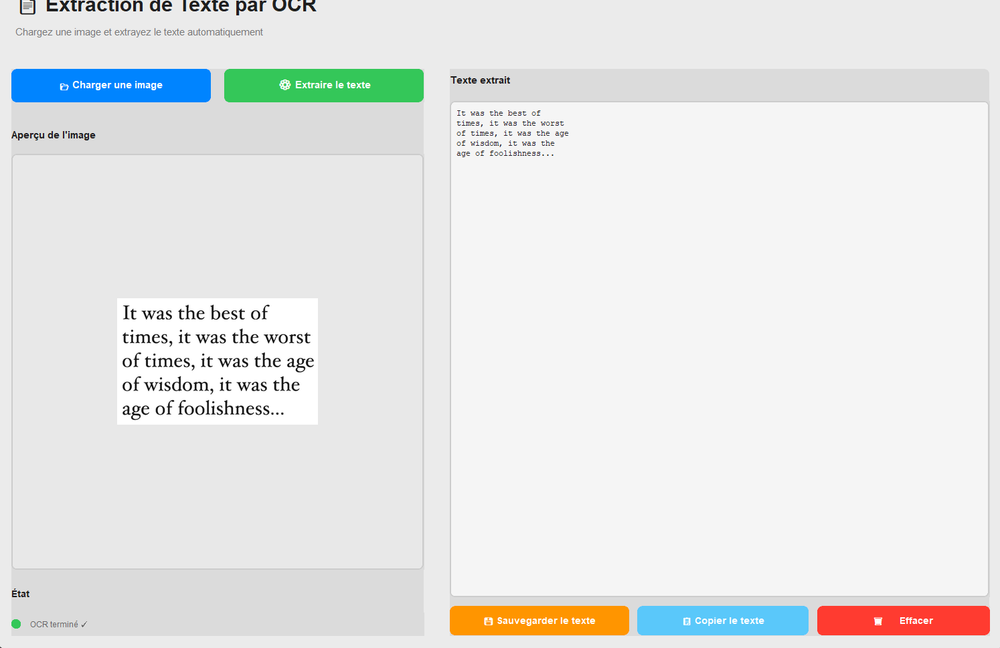

# 🎯 Mini-Projet OCR - Structure organisée



---

## 📁 Organisation du projet

```
Mini_projet_CV/
│
├── 📄 README.md                ← DÉMARRAGE : Lisez-moi d'abord !
│
├── 🐍 SRC/ - Code Source
│   ├── core/                   Logique OCR (réutilisable)
│   │   ├── functions.py        Fonctions OCR de base
│   │   └── main.py             Version CLI
│   │
│   └── gui/                    Application graphique
│       ├── gui_app.py          GUI moderne (CustomTkinter)
│       ├── launch_gui.py       Lanceur simplifié
│       └── config.py           Configuration
│
├── 📚 DOCS/ - Documentation
│   ├── QUICKSTART_GUI.md       👤 5 min pour démarrer
│   ├── README_GUI_UPGRADE.md   👨‍💼 Vue d'ensemble upgrade
│   ├── ARCHITECTURE.md         👨‍💻 Structure technique
│   ├── ADVANCED_GUIDE.md       🔧 Cas avancés
│   ├── INDEX.md                📚 Navigation complète
│   ├── MANIFEST.md             📋 Inventaire détaillé
│   └── RECAP_FINAL.md          🎉 Résumé final
│
├── 🛠️ UTILS/ - Utilitaires
│   ├── create_sample_image.py  Génère images de test
│   └── install_tesseract.ps1   Installation Tesseract (Windows)
│
├── 📂 DATA/ - Données
│   ├── images/                 Vos images pour OCR
│   │   └── document.png        Exemple de test
│   └── output/                 Résultats OCR (généré)
│
├── 📦 requirements_gui.txt     Dépendances Python
└── 🌳 STRUCTURE.md             Documentation structure
```

---

## 🚀 Démarrage rapide

### Pour utilisateurs finaux (GUI)

```bash
# 1. Installer les dépendances
pip install -r requirements_gui.txt

# 2. Lancer l'application
python src/gui/launch_gui.py

# 3. C'est tout ! 🎉
```

**Voir**: `docs/QUICKSTART_GUI.md`

### Pour développeurs (CLI + API)

```bash
# Option 1 : CLI simple
python src/core/main.py data/images/document.png

# Option 2 : Utiliser dans votre code
from src.core.functions import load_image, preprocess_image
import pytesseract

img = load_image("image.png")
processed = preprocess_image(img)
text = pytesseract.image_to_string(processed)
```

**Voir**: `docs/README_GUI_UPGRADE.md`

---

## 📋 Guide de navigation

### Je veux...

| Objectif | Lire | Fichier |
|----------|------|---------|
| **Démarrer rapidement** | QUICKSTART_GUI.md | 5 min |
| **Comprendre l'upgrade** | README_GUI_UPGRADE.md | 10 min |
| **Connaître l'architecture** | ARCHITECTURE.md | 20 min |
| **Cas avancés & debug** | ADVANCED_GUIDE.md | 30 min |
| **Naviguer le projet** | INDEX.md | 5 min |
| **Tout inventorier** | MANIFEST.md | 10 min |
| **Résumé final** | RECAP_FINAL.md | 5 min |

---

## 📁 Détails des dossiers

### 🐍 `src/` - Code source

#### `src/core/` - Logique OCR réutilisable
```
functions.py           Fonctions de traitement image
├─ load_image()       Charge image avec OpenCV
└─ preprocess_image() Gris + Blur + Binarisation

main.py               Version CLI (ligne de commande)
├─ extract_text_from_image()
├─ main()
└─ Gestion erreurs
```

**Utilisation** :
```python
from src.core.functions import load_image, preprocess_image
```

#### `src/gui/` - Application graphique moderne
```
gui_app.py            Interface GUI complète (~450 lignes)
├─ Classe OCRApp
├─ UI 2 panneaux
├─ Threading OCR
├─ Gestion fichiers
└─ Raccourcis clavier

launch_gui.py         Lanceur simplifié
└─ python src/gui/launch_gui.py

config.py             Configuration centralisée
├─ Tesseract path
├─ Thème (clair/sombre)
├─ Géométrie fenêtre
└─ Personnalisation
```

**Utilisation** :
```bash
python src/gui/launch_gui.py
```

---

### 📚 `docs/` - Documentation

| Fichier | Audience | Longueur |
|---------|----------|:--:|
| **QUICKSTART_GUI.md** | Tous | 2-3 min |
| **README_GUI_UPGRADE.md** | Managers/Décideurs | 10 min |
| **ARCHITECTURE.md** | Développeurs | 20 min |
| **ADVANCED_GUIDE.md** | Experts | 30 min |
| **INDEX.md** | Navigation | 5 min |
| **MANIFEST.md** | Inventaire | 10 min |
| **RECAP_FINAL.md** | Résumé | 5 min |

**Lire dans cet ordre** :
1. QUICKSTART_GUI.md (démarrage)
2. README_GUI_UPGRADE.md (vue d'ensemble)
3. ARCHITECTURE.md (technique)
4. ADVANCED_GUIDE.md (avancé)

---

### 🛠️ `utils/` - Utilitaires

```
create_sample_image.py
├─ Génère images/document.png
└─ Usage : python utils/create_sample_image.py

install_tesseract.ps1
├─ Installation Tesseract (Windows)
└─ Usage : powershell -ExecutionPolicy Bypass -File utils/install_tesseract.ps1
```

---

### 📂 `data/` - Données

```
data/
├── images/
│   ├── document.png        Image d'exemple (générée)
│   └── (vos images ici)
│
└── output/                 Résultats OCR (généré)
    └── *.txt              Fichiers texte extraits
```

**Ajouter vos images** :
```bash
cp votre_image.png data/images/
python src/gui/launch_gui.py
```

---

## 🔍 Flux d'utilisation

### Scenario 1 : Utilisateur final (GUI)

```
1. python src/gui/launch_gui.py
   ↓
2. Fenêtre GUI s'ouvre
   ↓
3. Cliquer "📂 Charger une image"
   ↓
4. Sélectionner image depuis data/images/
   ↓
5. Cliquer "⚙️ Extraire le texte"
   ↓
6. Texte s'affiche dans zone droite
   ↓
7. Cliquer "💾 Sauvegarder"
   ↓
8. Fichier créé dans data/output/
```

### Scenario 2 : Développeur (Code)

```
from src.core.functions import load_image, preprocess_image
import pytesseract

def ocr_batch(folder):
    for img in os.listdir(folder):
        img_path = os.path.join(folder, img)
        processed = preprocess_image(load_image(img_path))
        text = pytesseract.image_to_string(processed)
        
        # Sauvegarder
        out_file = img.replace('.png', '.txt')
        with open(out_file, 'w', encoding='utf-8') as f:
            f.write(text)

ocr_batch("data/images/")
```

---

## 📦 Dépendances

### Python packages
```
opencv-python==4.12.0.88        # Traitement images
pytesseract==0.3.13             # Wrapper Tesseract
customtkinter==5.2.0            # GUI moderne
pillow>=8.0.0                   # Images
numpy>=2                        # Matrices
```

### Système (external)
```
Tesseract OCR 5.x+              # OCR engine
Python 3.7+                     # Runtime
```

**Installation** :
```bash
pip install -r requirements_gui.txt

# Windows : Télécharger Tesseract depuis
# https://github.com/tesseract-ocr/tesseract

# Linux : sudo apt install tesseract-ocr
```

---

## 🎨 Structure de code

```python
# Architecture générale

src/
├── core/
│   ├── functions.py
│   │   ├── load_image(path)           → img
│   │   └── preprocess_image(img)      → processed_img
│   │
│   └── main.py
│       ├── extract_text_from_image(path)  → text
│       └── main()
│
└── gui/
    ├── config.py
    │   ├── TESSERACT_PATH
    │   ├── APPEARANCE_MODE
    │   └── ...
    │
    ├── gui_app.py
    │   ├── class OCRApp(ctk.CTk)
    │   │   ├── _create_ui()
    │   │   ├── load_image()
    │   │   ├── run_ocr_threaded()
    │   │   ├── save_text()
    │   │   ├── copy_text()
    │   │   └── clear_all()
    │   │
    │   └── main()
    │
    └── launch_gui.py
        └── if __name__ == '__main__': main()
```

---

## ✅ Checklist d'installation

```bash
# 1. Python
[ ] Python 3.7+ : python --version

# 2. Dépendances Python
[ ] pip install -r requirements_gui.txt

# 3. Tesseract
[ ] Installé (vérifiez : tesseract --version)
[ ] Dans PATH (ou config.py mis à jour)

# 4. Test GUI
[ ] python src/gui/launch_gui.py
[ ] Fenêtre s'ouvre
[ ] Bouton "Charger" fonctionne
[ ] OCR extrait texte

# 5. Documentation
[ ] Lisez docs/QUICKSTART_GUI.md
[ ] Lisez docs/ARCHITECTURE.md (si dev)
```

---

## 🚀 Commandes utiles

```bash
# Démarrer GUI
python src/gui/launch_gui.py

# CLI : OCR une image
python src/core/main.py data/images/document.png

# Générer image de test
python utils/create_sample_image.py

# Installer Tesseract (Windows)
powershell -ExecutionPolicy Bypass -File utils/install_tesseract.ps1

# Installer dépendances Python
pip install -r requirements_gui.txt

# Voir version Tesseract
tesseract --version
```

---

## 📊 Résumé des fichiers

| Fichier | Dossier | Type | Rôle |
|---------|---------|------|------|
| `functions.py` | `src/core/` | 🐍 Python | Core OCR |
| `main.py` | `src/core/` | 🐍 Python | CLI |
| `gui_app.py` | `src/gui/` | 🐍 Python | GUI principale |
| `launch_gui.py` | `src/gui/` | 🐍 Python | Lanceur |
| `config.py` | `src/gui/` | 🐍 Python | Config |
| `QUICKSTART_GUI.md` | `docs/` | 📄 Doc | Guide rapide |
| `README_GUI_UPGRADE.md` | `docs/` | 📄 Doc | Vue d'ensemble |
| `ARCHITECTURE.md` | `docs/` | 📄 Doc | Technique |
| `ADVANCED_GUIDE.md` | `docs/` | 📄 Doc | Avancé |
| `create_sample_image.py` | `utils/` | 🐍 Util | Génère images |
| `install_tesseract.ps1` | `utils/` | 📝 Util | Install Tesseract |
| `requirements_gui.txt` | Racine | 📦 Config | Dépendances |
| `document.png` | `data/images/` | 🖼️ Image | Test |

---

## 🔄 Schéma d'utilisation

```
┌─────────────────────────────────────────┐
│ Utilisateur Final                       │
│ python src/gui/launch_gui.py            │
└────────────┬────────────────────────────┘
             │
        ┌────▼─────────────────────┐
        │   Application GUI         │
        │  (src/gui/gui_app.py)     │
        └────┬──────────────┬───────┘
             │              │
    ┌────────▼──┐    ┌─────▼──────────┐
    │ Charger    │    │ Extraire OCR   │
    │ Image      │    │ Threading      │
    └────┬───────┘    └─────┬──────────┘
         │                  │
    ┌────▼──────────────────▼─────┐
    │   src/core/functions.py     │
    │   (Core OCR réutilisable)   │
    └────┬────────────────────────┘
         │
    ┌────▼──────────────────────┐
    │   Tesseract OCR           │
    │   (Exécutable système)    │
    └─────────────────────────┘
```

---

## 💡 Bonnes pratiques

### Pour ajouter une nouvelle fonctionnalité
1. Créer en tant que fonction dans `src/core/functions.py`
2. L'intégrer dans `src/gui/gui_app.py` si GUI
3. Documenter dans `docs/`

### Pour déboguer
1. Vérifier les logs : voir `docs/ADVANCED_GUIDE.md`
2. Tester en CLI d'abord : `python src/core/main.py`
3. Puis en GUI : `python src/gui/launch_gui.py`

### Pour personnaliser
1. Éditer `src/gui/config.py`
2. Relancer : `python src/gui/launch_gui.py`

---

## 📚 Ressources

- **Tesseract** : https://github.com/tesseract-ocr/tesseract
- **OpenCV** : https://opencv.org/
- **CustomTkinter** : https://github.com/TomSchimansky/CustomTkinter
- **pytesseract** : https://github.com/madmaze/pytesseract

---

## 🎉 Conclusion

Le projet est maintenant **bien organisé** avec :
- ✅ Code séparé en modules logiques
- ✅ Documentation claire et organisée
- ✅ Données centralisées
- ✅ Utilitaires accessibles
- ✅ Structure scalable

**Vous êtes prêt à développer !** 🚀

---

Voir aussi : `docs/INDEX.md` pour une navigation complète.
